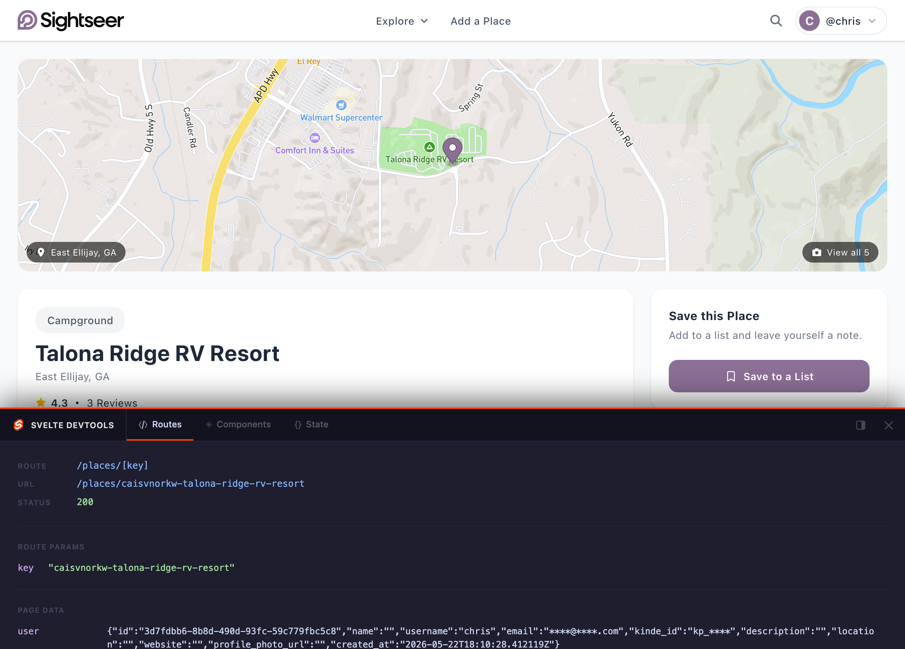

# Svelte DevTools

[](https://www.npmjs.com/package/@svelte-devtools/vite-plugin)
[](https://www.npmjs.com/package/@svelte-devtools/kit)
[](https://github.com/chrislentz/svelte-devtools/actions/workflows/ci.yml)
[](./LICENSE)

A zero-config Vite plugin that injects a floating devtools panel into your Svelte 5 or SvelteKit app during development. Inspect routes, hover-highlight components in the DOM tree, and track runes state — all without leaving the browser. Drop-in setup, nothing included in production builds.



## Features

- **Routes Tab** — current route ID, URL, status code, route params, and page data from `load()`
- **Components Tab** — live DOM tree with hover-to-highlight; click to expand/collapse subtrees
- **State Tab** — SvelteKit `page` store + any component runes state you opt in to expose
- Resizable **bottom** or **right** drawer, position persisted across reloads
- Keyboard shortcut `⇧ + ⌥ + D` / `Shift + Alt + D` to toggle open/close

## Installation

### SvelteKit

```bash
npm install -D @svelte-devtools/vite-plugin @svelte-devtools/kit
```

**`vite.config.ts`**

```ts
import { defineConfig } from 'vite';
import { sveltekit } from '@sveltejs/kit/vite';
import { svelteDevtools } from '@svelte-devtools/vite-plugin';

export default defineConfig({
  plugins: [sveltekit(), svelteDevtools()],
});
```

**`src/hooks.server.ts`**

```ts
import { sequence } from '@sveltejs/kit/hooks';
import { svelteDevtoolsHandle } from '@svelte-devtools/kit';

export const handle = sequence(svelteDevtoolsHandle);
```

> The SvelteKit handle is required because SvelteKit's SSR bypasses Vite's `transformIndexHtml`. The handle injects the devtools script tag via `transformPageChunk` instead.

### Vite + Svelte (no SvelteKit)

```bash
npm install -D @svelte-devtools/vite-plugin
```

**`vite.config.ts`**

```ts
import { defineConfig } from 'vite';
import { svelte } from '@sveltejs/vite-plugin-svelte';
import { svelteDevtools } from '@svelte-devtools/vite-plugin';

export default defineConfig({
  plugins: [svelte(), svelteDevtools()],
});
```

No handle hook needed — the script is injected via `transformIndexHtml`.

## Exposing component state

The **State tab** automatically shows the SvelteKit `page` store. To also display local runes state from a component, push it to `window.__sdt` inside a `$effect`:

```ts
$effect(() => {
  (window as any).__sdt.componentState = { count, name };
  window.dispatchEvent(new CustomEvent('__sdt:update', { detail: { type: 'state' } }));
});
```

The devtools panel will pick this up and display it under **Component State** alongside the page store.

## Options

`svelteDevtools()` currently takes no configuration — just call it with no arguments. Options will be added in a future release.

## Keyboard shortcut

| Shortcut | Action |
|---|---|
| `⇧ ⌥ D` / `Shift + Alt + D` | Toggle the devtools panel |

The toggle button is always visible as a pill at the bottom center of the page.

## Development

```bash
# 1. Clone and install
git clone https://github.com/chrislentz/svelte-devtools.git
cd svelte-devtools
npm run setup          # installs deps + builds the overlay bundle

# 2. Start the playground
npm run dev            # http://localhost:3001

# 3. Rebuild the overlay after making changes
npm run build:overlay  # or: npm run dev:overlay (watch mode, use alongside npm run dev)
```

### Monorepo structure

```
packages/
  overlay/       — Svelte 5 panel UI (pre-built to dist/overlay.js, not published)
  vite-plugin/   — published as @svelte-devtools/vite-plugin
  kit/           — published as @svelte-devtools/kit
playground/      — SvelteKit sandbox for manual testing
```

## Contributing

See [CONTRIBUTING.md](./CONTRIBUTING.md).

## License

[MIT](./LICENSE) © Chris Lentz
